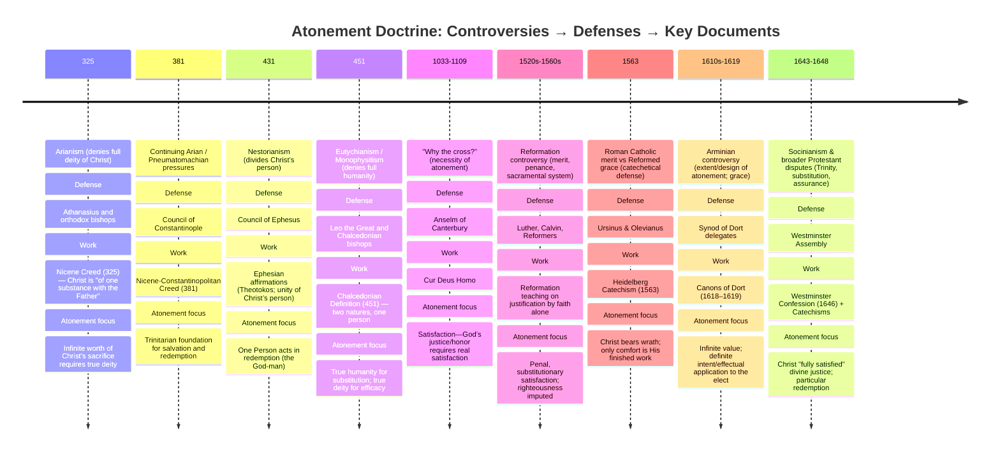

# {{ page.meta.title }}

**Date:** {{ page.meta.date }}  
**Instructor:** {{ page.meta.instructor }}  
**Course:** {{ page.meta.course }}  
**Description:** {{ page.meta.description }}  
**BibleReference:** {{ page.meta.bibleReference }}

## CDI Notes

**Instructors Guide** *(pg.270-284)*

- You will KNOW:
    - See the need to contend for the faith.

- You will BE ABLE TO:
    - The Reformers looked upon sin primarily as transgression of the law of God and therefore as guilt rather than as an insult.

- You will THINK ABOUT:
    - The challenges to the Doctrine of the Atonement.

- In the Last Session
    - You learned how the Doctrine of the Atonement developed up to the time of the Reformation.
    - You understood the challenges faced by those trying to develop the Doctrine of the Atonement.
    - You thought about the value of the sacrifice of Jesus Christ in relation to our sin.

**Begin video.**

**The Doctrine of the Atonement (Since the Reformation)**

- The doctrine of the atonement was not a subject of debate between the Reformers and the Catholic Church.
    - Both regarded the death of Christ as a satisfaction for sin.
    - A satisfaction of infinite value.
- They differed primarily on how the work of Christ is applied to believers.
    - The Reformers moved along lines of agreement with Anselm.
    - He taught that forgiveness of sins was a gift from God based on the atoning work of Jesus Christ.
    - The Catholic Church agreed with Thomas Aquinas.
    - He taught that the fullness of grace dwells in the human nature of Christ, who is now the head of the human race. And therefore, His perfection and virtue overflow to the members of His body, those who are baptized.

**The Reformers and Anselm**

- Both the Reformers and Anselm maintained the objective nature of the atonement and regarded it as a necessity.
- However, they differed as to the nature of this necessity.
- Anselm speaks of this as absolute.
- Some Reformers regarded it as relative or hypothetical.
- Calvin says, *“...The necessity (of the atonement) was not commonly (seen as) simple or absolute, but flowed from the divine decree on which the salvation of mankind depended. What was best for us, our most merciful Father determined.”*
- It would be unfair to say that Calvin makes the atonement dependent on the arbitrary will of God.
- He recognizes no *“to be determined”* will in God, but only a will that has been determined by all His attributes.
- He emphasizes the fact that the atonement in Christ fully satisfies the justice of God.
- The Reformers agreed that the atonement, through the sufferings and death of Christ, is in harmony with divine wisdom and revelation.
- The doctrine of the atonement developed by the Reformers improved on Anselm’s in several ways.
- The Reformers looked upon sin primarily as transgression of the law of God and therefore as guilt rather than as an insult.
- The Reformers saw the death of Christ as a penal sacrifice to satisfy the justice of God. This lifts atonement out of the sphere of private rights into that of public law.
- The Reformers stressed the fact that the sufferings of Christ were not only penal but also vicarious, service as a substitute.
- The Reformers distinguished between the active and passive obedience in the work of Christ as the mediator.
- His life and His sufferings together, satisfied the demands of divine justice.
- The Reformers agreed with the importance of the mystical union with Christ but also directed attention to the conscious act of man by which he appropriates the righteousness of Christ – the act of faith.
- They were also very careful not to represent faith as merit or earning justification.

**Faustus Socinus**

- The Socinian *(sow-si’gn-ee-un)* conception of The Atonement comes from the teachings of Faustus Socinus *(sow-si’gn-us)* and forms the foundation for Unitarianism.
- His teaching was, at least partly, a reaction to the Reformers.
- He was an Italian, rationalistic, religious, reformer who denied the Trinity and so the divinity of Christ.
- He held that we gain salvation only by practicing the virtues exemplified in Christ, (our good works) which we learn as we study the Scriptures.
- In his view, faith is more than the belief that the teaching of Christ is true, but it also results in repentance of sins and in obedience that leads to eternal life.
- Socinian (sow-si’gn-ee-un) doctrine is a concoction of several heresies condemned by the early church.
- Pelagianism with its belief in the inherent goodness and spiritual ability of man.
- The Adoptionist doctrine, making Christ in His human nature a Son of God by adoption.
- The Moral Influence theory with its emphasis on the exemplary life of Christ.
- The Scotus doctrine of an arbitrary will in God.
- We can summarize the Socinian conception of the Atonement as being thoroughly rationalistic (and arrogant); an abstract play of human logic.
- Failing to do justice to the truth revealed in the word of God (which he ironically appealed to).
- Failing to do justice to the truth experienced in the lives of the redeemed.

**Hugo Grotius**

- For some reason, Hugo Grotius (grow-she-us), a Dutch legal scholar and Arminian supporter, sought a middle ground between the Reformers and the Socinian view.
- In seeking to eliminate the idea of the Atonement as satisfying the justice of God, he taught that the Ruler of the universe could modify or even abolish the law and its penalty altogether.
- So – the question arises – Why didn’t God simply officially abolish the law, since this was within His power?
- Grotius answered, (revealing a rather low view of God) that God as the Ruler of the universe had to maintain order in His great realm.
- It would not have been safe for Him to remit without revealing in some way the inviolable nature of the law and His holy displeasure against sin.
- This is the Governmental Theory of the Atonement.

**The Arminian View**

- The Arminian view of the Atonement represents the death of Christ as a sacrificial offering.
- Maintaining that it was not the payment of a debt, a complete satisfaction of justice.
- It is merely an accompanying condition of the forgiveness of sins.
- They regarded the sufferings of Christ as penal and judicial and that they had the effect of reconciling God to humanity, by purchasing the forgiveness of sins.
- However, they did not view His sacrifice as an equivalent substitutional penalty but one that is of inferior worth.
- They described it as a “satisfaction of benevolence.”
- The Arminians disagreed with the Reformers (Calvinists) in four areas regarding the Atonement.
- Christ did not endure the full penalty of sin since He did not suffer eternal death.
- If Christ completely atoned for sin, there is nothing for divine grace to accomplish and no need for divine compassion.
- If Christ rendered full satisfaction, then God has no right to demand faith and obedience or to punish the sinner, if he fails to obey (that would be double punishment.).
- The atonement is general or universal; it is made for the sins of humanity in general and of every individual.
- The divine intention is not universally effective since many are lost.
- This partial failure is due to the obstinacy of the sinner in refusing the offered atonement and so, defeats the divine intention. The application of the atoning work of Christ depending ultimately on the sinner’s will.

**The Synod of Dort**

- The Synod of Dort (Netherlands) opposed the doctrine of the Arminians, saying the atonement of Christ was sufficient for the salvation of all men but was intended only for those to whom it is effectively applied.

**The School of Saumur**

- The School of Saumur was a Calvinistic French Huguenot university that sought a compromise.
- They attempted to tone down the extreme Calvinism of the Synod of Dort and at the same time avoid the extremes of Arminianism.
- Moses Amyraldus proposed that Christ did indeed die for all men, and decreed beforehand that it was by repentance and faith in Christ that all men should be saved.
- God knowing, that left to their own devices, none would ever repent and believe, so by a subsequent decree elected some as the objects of the saving operation of His grace. These alone are those actually saved.
- They succeeded in getting the Arminians to agree with their first decree and the Calvinists to agree with their second but not in uniting the two groups.

**Challenges to the Doctrine of the Atonement**

- Since the Reformation, the doctrine of the atonement has continually faced challenges.
- Most often, the challenge was trying to reconcile Calvinists and Arminians.
- There were also many threats from liberal theology, which emphasized that Christ’s work was a moral influence of some sort, rather than atonement for sin.
- In Great Britain during the 16th and 17th centuries, Neonomianism (New Law) turned the Gospel into a new law.
- This view said that Christ made salvation possible for all and then introduced a new law – the law of the Gospel, which requires faith and conversion.
- Justification is based on our own imperfect work of faith and conversion, rather than the imputed righteousness of Jesus Christ.
- This is only Arminianism by another name.
- There was strong opposition to this teaching, which ultimately led to a split in the Church of Scotland in 1733.
- The liberal theology that dominated Germany in the 17th and 18th century had a devastating effect on churches around the world.
- Schleiermacher (sh-li’ar-mocker) and Ritschl (rich-el) were leading voices in the deconstruction of the Scriptures as the Word of God, of Jesus as the Son of God and of His atonement for our sins.

- Please note: not all German theologians bought into their ideas. The Lord did not leave Himself without a witness.
- The Church continues to meet with reproductions of most of the typical theories we have considered in the preceding sections – with some variations and combinations.
- Perhaps this portion of our study helps us understand the urgency of Jude as he wrote in **Jude 1:3** – *“Beloved, while I was making every effort to write you about our common salvation, I felt the necessity to write to you appealing that you contend earnestly for the faith which was once for all handed down to the saints.”*

**To Consider**

- Many of the problems surrounding the Doctrine of the Atonement relate to speculation and over reaction to the errors of others.
- The Attacks on the Doctrine of the Atonement seem to be relentless.
- Jude 1:3

**Review**

- Learned how the Doctrine of the Atonement developed during and since the time of the Reformation.
- Understand the challenges faced by those trying to defend the Doctrine of the Atonement.
- Thought about the work of Jesus Christ in relation to our sin from a biblical foundation.

**In the Next Session**

- We will be discussing in the History of Christian Doctrine, the section on the Doctrine of the Application and Appropriation of Divine Grace.

## Key Verses

## Class Exercise

**INSTRUCTOR’S NOTES: THE DOCTRINE OF ATONEMENT**

For the rest of this session, your students will spend time discussing the notes for this section, what they have learned and what they have written in their summaries of the sections of our textbook that cover the Doctrine of the Atonement during and since the Reformation.

There are a series of questions or assignments numbered and in bold letters.

Because of time constraints, use your discretion regarding which of these you would like to have your students work on and discuss as a group. You can lead these discussions yourself or assign some of them to individuals or groups and have them make a presentation or lead the discussion. One suggestion would be to have at least one student (or more, depending on your situation) share their summary as you cover each of the sections in the notes below.

**The History of Christian Doctrine**
by Louis Berkhof

## Question 1

**1. Note the improvements or corrections to Anselm’s teaching.**  
The Reformers improved and clarified Anselm’s doctrine of the atonement in several important, biblically grounded ways:

1. **Sin defined as legal guilt before God**  
    Anselm emphasized sin as an insult to God’s honor. The Reformers more clearly defined sin as **transgression of the law of God**, resulting in real guilt before a righteous Judge.

    - *“Everyone who practices sin also practices lawlessness; and sin is lawlessness.”* (**1 John 3:4**)  
    - *“For all have sinned and fall short of the glory of God.”* (**Romans 3:23**)  

    This places the atonement in the judicial realm of divine justice, not merely wounded honor.

2. **The atonement as a penal sacrifice**  
    The Reformers stressed that Christ’s death was **penal** — He bore the penalty required by divine justice.

    - *“He made Him who knew no sin to be sin on our behalf, so that we might become the righteousness of God in Him.”* (**2 Corinthians 5:21**)  
    - *“But He was pierced through for our transgressions… The chastening for our well-being fell upon Him.”* (**Isaiah 53:5**)  

    Christ did not merely restore honor — He satisfied justice by bearing punishment.

3. **Emphasis on substitution (vicarious suffering)**  
    The Reformers clarified that Christ suffered **as our substitute**, in our place.

    - *“Christ redeemed us from the curse of the Law, having become a curse for us.”* (**Galatians 3:13**)  
    - *“The Son of Man did not come to be served, but to serve, and to give His life a ransom for many.”* (**Mark 10:45**)  

    His suffering was not symbolic, but truly vicarious.

4. **Distinction between active and passive obedience**  
    The Reformers distinguished between:

    - **Active obedience** — Christ’s perfect fulfillment of the law  
        - *“For as through the one man’s disobedience the many were made sinners, even so through the obedience of the One the many will be made righteous.”* (**Romans 5:19**)  

    - **Passive obedience** — His suffering and death under the penalty of sin  
        - *“He humbled Himself by becoming obedient to the point of death, even death on a cross.”* (**Philippians 2:8**)  

    Both His life and His death satisfied the demands of divine justice.

5. **Justification received by faith — not merit**  
    While affirming union with Christ, the Reformers emphasized that justification is received through faith — yet faith itself is not meritorious.

    - *“For we maintain that a man is justified by faith apart from works of the Law.”* (**Romans 3:28**)  
    - *“For by grace you have been saved through faith; and that not of yourselves, it is the gift of God; not as a result of works.”* (**Ephesians 2:8–9**)  

    Faith is the instrument, not the ground, of justification.

6. **The necessity of the atonement grounded in God’s attributes**  
    Anselm described the atonement as absolutely necessary. The Reformers clarified that its necessity flows from the harmony of God’s attributes — especially His justice and righteousness.

    - *“So that He would be just and the justifier of the one who has faith in Jesus.”* (**Romans 3:26**)  

    God does not act arbitrarily; the atonement fully satisfies His justice while expressing His mercy.

## Question 1 Summary

The Reformers improved on Anselm by:

- Defining sin as legal guilt before God  
- Presenting Christ’s death as a penal, substitutionary sacrifice  
- Distinguishing His active and passive obedience  
- Clarifying justification by faith alone  
- Grounding the necessity of the atonement in the full character of God  

In doing so, they presented a more fully biblical and judicial understanding of the work of Christ.

## Question 2

**2. What does the teaching of Socinus tell us about His view of God?**

Socinus presents a view of God that is profoundly diminished and unbiblical. His teaching reduces God to a being whose justice is not an essential attribute, but merely an expression of His will. In this framework, God may forgive or punish without any necessary satisfaction of justice. That makes divine justice optional rather than intrinsic.

Scripture, however, teaches that justice is not external to God’s nature:

- *“The Rock! His work is perfect, for all His ways are just; a God of faithfulness and without injustice, righteous and upright is He.”* (**Deuteronomy 32:4**)  
- *“Righteousness and justice are the foundation of Your throne.”* (**Psalm 89:14**)  

Socinus also denies substitution and satisfaction, which ultimately weakens the necessity of the cross. But Scripture presents God as both just and the justifier:

- *“So that He would be just and the justifier of the one who has faith in Jesus.”* (**Romans 3:26**)  
- *“Without shedding of blood there is no forgiveness.”* (**Hebrews 9:22**)  

His view lowers God’s holiness, diminishes His justice, and turns forgiveness into a simple act of leniency based on repentance and obedience rather than on a completed atonement.

Frankly, because Socinus’ conception of God is so limited — making Him arbitrary, reactive, and dependent upon human moral improvement — it does not deserve extended treatment. It presents a God who does not uphold His own justice and who requires no true satisfaction for sin. That is not the God of Scripture.

The biblical God is holy (**Isaiah 6:3**), just (**Romans 3:25–26**), wise (**Romans 11:33**), and loving (**John 3:16**) — and His love does not bypass justice but fulfills it in the substitutionary death of Christ.

## Question 3

**3. What does it mean that “the death of Christ….is merely an accompanying condition of the forgiveness of sins”?**

To say that Christ’s death is merely an accompanying condition of forgiveness means that His death is not viewed as the full, substitutionary satisfaction of divine justice, but only as something that makes forgiveness possible or appropriate. It denies that Christ bore the exact penalty of sin in the place of sinners.

However, Scripture presents something far deeper.  
Christ did not merely accompany forgiveness — He **accomplished** it through bearing wrath.

### 1. Christ Bore the Wrath of Man

During the crucifixion, Christ endured the hatred, injustice, and violence of mankind:

- *“This Man… you nailed to a cross by the hands of godless men and put Him to death.”* (**Acts 2:23**)
- *“He was despised and forsaken of men.”* (**Isaiah 53:3**)

He endured the full hostility of fallen humanity.

### 2. Christ Bore the Wrath of God

More importantly, during the three hours of darkness, Christ endured the judgment of God against sin.

- *“Now from the sixth hour darkness fell upon all the land until the ninth hour.”* (**Matthew 27:45**)
- *“My God, My God, why have You forsaken Me?”* (**Matthew 27:46**)

Death in Scripture fundamentally means separation. Adam died spiritually the day he sinned — separation from God — and later physically:

- *“In the day that you eat from it you will surely die.”* (**Genesis 2:17**)

Likewise, Christ experienced the reality of separation under divine judgment. During those three hours of darkness, He bore the wrath of God that we deserved:

- *“Surely our griefs He Himself bore… the Lord has caused the iniquity of us all to fall on Him.”* (**Isaiah 53:4, 6**)
- *“He Himself bore our sins in His body on the cross.”* (**1 Peter 2:24**)
- *“God displayed Him publicly as a propitiation in His blood.”* (**Romans 3:25**)

Propitiation means the satisfying of wrath.

When that wrath was fully satisfied, Christ declared:

- *“It is finished.”* (**John 19:30**)

The payment was complete.

### 3. Spiritual Death Followed by Physical Death

As Adam experienced spiritual death before physical death, so Christ experienced judicial separation before His physical death. Yet because He was sinless:

- *“For You will not abandon My soul to Hades, nor allow Your Holy One to undergo decay.”* (**Psalm 16:10; Acts 2:27**)

Death had no rightful claim on Him. Therefore:

- *“No one takes it from Me, but I lay it down on My own initiative.”* (**John 10:18**)

Within moments after the satisfaction of wrath, He willingly gave up His spirit:

- *“Father, into Your hands I commit My spirit.”* (**Luke 23:46**)

## Question 3 Conclusion

The death of Christ was not merely an accompanying condition of forgiveness. It was the **penal, substitutionary bearing of divine wrath**, fully satisfying the justice of God.

Forgiveness is not granted because God simply chooses to overlook sin. It is granted because His justice was satisfied in the sinless Substitute.

Christ endured:

- The wrath of man
- The wrath of God
- Spiritual separation under judgment
- Physical death

And when justice was satisfied, He willingly laid down His life for us.  
That is not a partial atonement — that is a finished work.

## Question 4

**4. How would you respond to this idea, that our faith in Christ is a “righteous act” by which we “save ourselves”?**

### Who Did Christ Die For?

The Reformers, particularly Calvin, affirmed that Christ’s atonement was definite in its design — often referred to as *limited atonement*, or more accurately, **definite redemption**. This does not mean the atonement lacks value or sufficiency. Rather, it means its saving intent was directed toward a particular people.

Scripture repeatedly speaks of Christ dying for **His people**:

- *“She will bear a Son; and you shall call His name Jesus, for He will save His people from their sins.”* (**Matthew 1:21**)  
- *“Blessed be the Lord God of Israel, For He has visited us and accomplished redemption for His people.”* (**Luke 1:68**)  
- *“To give to His people the knowledge of salvation By the forgiveness of their sins.”* (**Luke 1:76–77**)  
- *“He entered the holy place once for all… having obtained eternal redemption.”* (**Hebrews 9:11–12**)  

Christ did not merely make redemption possible — He **obtained** it. His priestly work was effective and accomplished.

Jesus Himself confirms the definite nature of His redemptive mission:

- *“All that the Father gives Me will come to Me.”* (**John 6:37**)  

The Father gives a people. The Son redeems that people. The Spirit applies that redemption to that people. There is no uncertainty in the divine plan.

Thus, the atonement is sufficient in value because Christ is infinite in worth — but it is effective for the elect, those whom the Father chose before the foundation of the world and whom the Son came to redeem.

### Did Christ Redeem Creation?

When Adam fell, the curse extended beyond humanity to all creation:

- *“Cursed is the ground because of you.”* (**Genesis 3:17**)  
- *“For the creation was subjected to futility… in hope that the creation itself also will be set free from its slavery to corruption.”* (**Romans 8:20–21**)  

Creation did not sin morally, but it suffers under the consequences of Adam’s fall. Scripture teaches that creation will be renewed — and that renewal is tied to the redemption of God’s people:

- *“For we know that the whole creation groans and suffers the pains of childbirth together until now.”* (**Romans 8:22**)  

The present order will pass through judgment:

- *“The heavens will pass away with a roar… and the earth and its works will be burned up.”* (**2 Peter 3:10**)  

But this is not annihilation — it is purification and transformation:

- *“According to His promise we are looking for new heavens and a new earth, in which righteousness dwells.”* (**2 Peter 3:13**)  
- *“Then I saw a new heaven and a new earth.”* (**Revelation 21:1**)  

Just as believers pass through death into resurrection life, creation itself will be renewed through judgment into a restored state.

## Question 4 Conclusion

Christ died specifically and effectively for **His elect — His sheep, His people, His church.** His atonement did not create a hypothetical redemption; it accomplished eternal redemption.

At the same time, because Christ is the second Adam, the restoration of His redeemed people results in the renewal of creation itself.

Redemption is definite for His people.  
Renewal is cosmic in scope.  
Both unfold according to God’s sovereign and unthwartable plan.

## Question 5

**5. Discuss the following: When we are reacting to teaching that is false or out of balance, we face the danger of over-reacting, perhaps using dubious language or even refusing to use solid biblical language in trying to re-balance the teaching. Even if we are not out of balance ourselves, we are sometimes accused of heresy. There is certainly a need to “contend earnestly for the faith which was once for all handed down to the saints.” (Jude 1:3)**

It is easy, especially after studying weak or unbiblical theories of the atonement, to become dismissive or even irritated. Some modern theories can sound shallow, man-centered, or logically inconsistent. However, Scripture calls us not only to defend truth, but to do so with humility and gentleness.

We are commanded to:

- *“Contend earnestly for the faith which was once for all handed down to the saints.”* (**Jude 1:3**)  
- *“The Lord’s bond-servant must not be quarrelsome, but be kind to all… correcting those who are in opposition with gentleness.”* (**2 Timothy 2:24–25**)  
- *“Speaking the truth in love.”* (**Ephesians 4:15**)  

It is possible to be doctrinally correct and spiritually harsh. That is an overreaction. When we encounter believers who hold to a more general view of the atonement — believing everyone has the opportunity or ability to choose — we must remember that many sincere Christians hold this position out of reverence for God’s love, not rebellion against truth.

Rather than reacting dismissively, we should:

1. Listen carefully before responding.
2. Ask clarifying questions.
3. Keep Scripture central.
4. Emphasize what we agree on — Christ crucified and salvation by grace.
5. Avoid unnecessary theological jargon.
6. Trust that the Spirit, not our forcefulness, changes hearts.

Truth matters. Words matter. Doctrine matters. But tone also matters.

The goal is not to win arguments, but to glorify Christ and build up His church. We must guard against pride — especially intellectual pride — when defending doctrines like election and definite atonement.

If God opened our eyes to truth, it was by grace alone. Therefore, we respond to others the same way God responded to us: patiently, graciously, and firmly grounded in Scripture.

To contend for the faith does not mean to be combative; it means to be faithful.

## Question 6

**6. Discuss the following: What the Scripture teaches matters. Words matter. Doctrine matters. “The doctrinal controversies of the Church were the birth pangs of new dogmas. Though not edifying, it is essential that we gain a proper understanding of the beginnings of ecclesiastical dogmas.”**

The doctrinal controversies of church history were often messy, painful, and divisive. They were not always pleasant to read, and at times they seem repetitive or even frustrating. However, they were not pointless. They were the “birth pangs” through which clearer theological formulations emerged.

Scripture itself affirms that truth must be guarded and clarified:

“Contend earnestly for the faith which was once for all handed down to the saints.” (Jude 1:3)

“Retain the standard of sound words which you have heard from me.” (2 Timothy 1:13)

“Pay close attention to yourself and to your teaching.” (1 Timothy 4:16)

Words matter because doctrine shapes how we understand God, salvation, and the work of Christ. If we misunderstand the atonement, we misunderstand the gospel. If we distort justification, we distort assurance. Theology is not abstract speculation — it defines the very message of salvation.

The controversies surrounding the atonement forced the Church to clarify:

- The nature of sin
- The justice of God
- The necessity of substitution
- The meaning of grace
- The certainty of redemption

Without these debates, we might not have the precision we now possess regarding penal substitution, justification by faith alone, and the sovereignty of grace.

Though the process was often uncomfortable, it strengthened the Church’s confession. God, in His providence, used error to refine truth — much like fire refines gold.

Therefore, studying these controversies is not merely academic. It deepens gratitude for those who labored to defend the gospel and sharpens our own responsibility to guard it faithfully.

Truth clarified is truth preserved.
Doctrine refined is doctrine strengthened.
And Scripture must always remain the final authority.

**Below this is AI driven reference material**

## What Does “Sufficient for All, Effective for the Elect” Mean?

Historically, Reformed theology has said:

> The atonement is **sufficient in value for all**, but **efficient (effective) only for the elect**.

This does **not** mean:

- Christ actually paid for the sins of every individual.
- Redemption is merely “possible” for everyone.
- God is hoping some will respond.

It means something more precise.

### 1️⃣ Infinite Sufficiency (Value)

Because Christ is the God-man, His sacrifice has infinite worth.

- *“He is the propitiation for our sins; and not for ours only, but also for those of the whole world.”* (**1 John 2:2**)
- *“Behold, the Lamb of God who takes away the sin of the world!”* (**John 1:29**)

These verses speak of the **scope** and global sufficiency of Christ’s work — not its individual application.

If God had purposed to save every person, Christ’s death would have been fully adequate to do so. There is no deficiency in the sacrifice.

### 2️⃣ Definite Design (Intent)

However, Scripture is equally clear that Christ died with a specific saving purpose for a definite people.

- *“I lay down My life for the sheep.”* (**John 10:15**)
- *“Christ loved the church and gave Himself up for her.”* (**Ephesians 5:25**)
- *“He will save His people from their sins.”* (**Matthew 1:21**)
- *“All that the Father gives Me will come to Me.”* (**John 6:37**)

Christ did not die vaguely or hypothetically. He died to actually save those given to Him by the Father.

### 3️⃣ Was Every Sin of Every Person Paid For?

If Christ literally bore the penalty for every sin of every person, then:

- No one could be condemned.
- God would be unjust to punish sins already paid for.

But Scripture says:

- *“He who does not believe has been judged already.”* (**John 3:18**)
- *“These will go away into eternal punishment.”* (**Matthew 25:46**)

Therefore, the atonement cannot be an actual substitutionary payment for every individual’s sins — or else universalism would follow.

### 4️⃣ What Did Christ Actually Accomplish?

Christ did not merely make redemption “possible.” He accomplished it.

- *“She will bear a Son; and you shall call His name Jesus, for He will save His people from their sins.”* (**Matthew 1:21**)  
- *“Blessed be the Lord God of Israel, For He has visited us and accomplished redemption for His people.”* (**Luke 1:68**)  
- *“To give to His people the knowledge of salvation By the forgiveness of their sins.”* (**Luke 1:76–77**)  
- *“He entered the holy place once for all… having obtained eternal redemption.”* (**Hebrews 9:11–12**)  

### 5️⃣ What About “World” Texts?

When Scripture says Christ died for the “world,” it often refers to:

- All nations (not Jews only)
- All kinds of people
- The global scope of salvation

For example:

- *“God so loved the world…”* (**John 3:16**) — meaning salvation is not restricted to Israel.
- *“Ransomed people for God from every tribe and tongue and people and nation.”* (**Revelation 5:9**)

The atonement is not tribal or ethnic — it is global in scope, but definite in design.

### So What Is the Correct Conclusion?

Here is the careful formulation:

Christ’s death is:

- **Infinite in value**
- **Sufficient to save all**
- **Designed to save the elect**
- **Effective only for those given to Him by the Father**

It does not create a hypothetical salvation waiting on man’s will.

It actually secures:

- Faith
- Repentance
- Justification
- Perseverance
    - *“As many as had been appointed to eternal life believed.”* (**Acts 13:48**)
    - *“He chose us in Him before the foundation of the world.”* (**Ephesians 1:4**)

## Addressing Your Concern

You asked:

> Does this make redemption “if possible” for the non-elect?

No.

In Reformed theology:

- Christ did not die to make salvation possible.
- He died to **save His people**.

Those not elected are not deprived of something purchased for them. Rather, they are left in their just condemnation (Romans 9:22).

## Final Clarified Statement

The atonement is sufficient for all because Christ’s sacrifice is of infinite worth.

It is effective for the elect because God intended it to actually secure their salvation — not merely offer it.

- There is no “wasted” atonement.
- There is no frustrated divine intention.
- There is no double payment for sin.

- Redemption is definite.
- Grace is sovereign.
- Justice is satisfied.

## Romans 5 and the Two Adams

### The Structure of the Passage

Paul builds a parallel:

| Adam                    | Christ                      |
| ----------------------- | --------------------------- |
| One act of disobedience | One act of obedience        |
| Brought condemnation    | Brings justification        |
| Many were made sinners  | Many will be made righteous |

Key text:

> *“So then as through one transgression there resulted condemnation to all men, even so through one act of righteousness there resulted justification of life to all men.”* (**Romans 5:18**)

> *“For as through the one man’s disobedience the many were made sinners, even so through the obedience of the One the many will be made righteous.”* (**Romans 5:19**)

### The Critical Question

If *“all men”* in Adam means every single human being without exception (which it does), does *“all men”* in Christ also mean every single human without exception?

If so — universalism follows.

But Paul is not teaching universalism.

So what is he teaching?

### Federal Headship

Paul is describing **two covenant heads**:

- Adam = representative head of fallen humanity
- Christ = representative head of redeemed humanity

All who are *“in Adam”* receive:

- Guilt
- Condemnation
- Death

All who are *“in Christ”* receive:

- Justification
- Righteousness
- Life

This is not potential language.
It is effectual language.

### Notice the Certainty

Paul does not say:

- “Christ made justification possible.”
- “Christ made righteousness available.”

He says:

> *“The many will be made righteous.”* (**Romans 5:19**)

That is definitive.

### The Parallel Demands Definiteness

If Adam’s sin **actually caused** condemnation for those he represented,
then Christ’s obedience must **actually cause** justification for those He represents.

If Christ died for every single individual the same way Adam represented every individual, then every individual would be justified.

But Scripture denies that:

> *“He who does not obey the Son will not see life, but the wrath of God abides on him.”* (**John 3:36**)

Therefore:

Christ’s representation must be limited to those united to Him.

### Who Is “In Christ”?

Paul answers elsewhere:

> *“There is now no condemnation for those who are in Christ Jesus.”* (**Romans 8:1**)  
> *“He chose us in Him before the foundation of the world.”* (**Ephesians 1:4**)  
> *“As many as had been appointed to eternal life believed.”* (**Acts 13:48**)  

Union with Christ is not universal.
It is particular.

### The Power of the Comparison

Here is the force of Paul’s logic:

- Adam did not make condemnation possible.
- Adam made condemnation certain.

Therefore:

- Christ did not make justification possible.
- Christ makes justification certain for those He represents.

That is definite atonement.

### This Strengthens the Earlier Statement

When we say:

> The atonement is sufficient for all, but effective for the elect —

Romans 5 shows:

- Christ’s death actually accomplishes righteousness.
- It actually secures justification.
- It actually brings life.

Not hypothetically.
Not conditionally.
But covenantally.

### The Beauty of It

This protects:

- The sovereignty of God
- The power of the cross
- The certainty of salvation
- The symmetry of redemption

Christ is not a weaker Adam.

He is a better Adam.

Adam’s act ruined all he represented.
Christ’s act redeems all He represents.

No more.
No less.

## Major Creeds & Confessions Defending the Atonement

### 1️⃣ The Nicene Creed (325 AD, expanded 381 AD)

**Controversy:**
Arianism — denied the full divinity of Christ.

**Time Period:**
4th Century (325–381 AD)

**Defender of the Faith:**
Athanasius and orthodox bishops

**Work Produced:**
Nicene Creed

**Atonement Clarified:**
If Christ is not fully God, His atonement cannot be of infinite value.
The Creed affirms Christ is:

> “Very God of very God… begotten, not made… of one substance with the Father.”

This preserved the **infinite sufficiency** of the atonement.

### 2️⃣ Council of Chalcedon (451 AD)

**Controversy:**
Monophysitism — denied Christ’s full humanity.

**Time Period:**
451 AD

**Defender:**
Leo the Great

**Work Produced:**
Chalcedonian Definition

**Atonement Clarified:**
Christ is:

> “Truly God and truly man… in two natures, without confusion…”

This preserved:

- True humanity (so He could represent us)
- True deity (so His sacrifice has infinite worth)

Without Chalcedon, substitution collapses.

### 3️⃣ Anselm — Satisfaction Theory (11th Century)

**Controversy:**
Why did Christ have to die?

**Time Period:**
1033–1109 AD

**Defender:**
Anselm of Canterbury

**Work Produced:**
Cur Deus Homo

**Atonement Clarified:**
Christ’s death was necessary to satisfy divine justice.

This moved the Church away from ransom-to-Satan theories.

### 4️⃣ The Heidelberg Catechism (1563)

**Controversy:**
Roman Catholic sacramental system & merit theology.

**Time Period:**
Reformation (16th Century)

**Defenders:**
Zacharias Ursinus and Caspar Olevianus

**Work Produced:**
Heidelberg Catechism

**Atonement Clarified:**
Christ bore:

> *“The wrath of God against the sin of the whole human race.”*

Strong penal substitution emphasis.

### 5️⃣ The Canons of Dort (1618–1619)

**Controversy:**
Arminianism — universal atonement & resistible grace.

**Time Period:**
1618–1619

**Defenders:**
Reformed delegates at the Synod of Dort

**Work Produced:**
Canons of Dort

**Atonement Clarified:**
Christ’s death was:

> “Of infinite worth and value… sufficient to atone for the sins of the whole world.”

But:

> Effectively intended for the elect.

This formally articulated **definite atonement**.

### 6️⃣ The Westminster Confession of Faith (1646)

**Controversy:**
Roman Catholicism, Arminianism, and Socinianism.

**Time Period:**
1646

**Defenders:**
The Westminster Assembly

**Work Produced:**
Westminster Confession of Faith

**Atonement Clarified:**

> “The Lord Jesus… did fully satisfy the justice of His Father.”

Explicit penal substitution and particular redemption.

## Summary Timeline

| Century | Controversy               | Defense      |
| ------- | ------------------------- | ------------ |
| 4th     | Christ not fully God      | Nicene Creed |
| 5th     | Christ not fully man      | Chalcedon    |
| 11th    | Why the cross?            | Anselm       |
| 16th    | Merit & sacramentalism    | Heidelberg   |
| 17th    | Arminianism               | Dort         |
| 17th    | Socinianism & Arminianism | Westminster  |

### What These Teach Us

The atonement was defended in stages:

1. Who is Christ? (Nicene, Chalcedon)
2. Why must He die? (Anselm)
3. What did His death accomplish? (Reformation confessions)

Each controversy clarified the gospel more precisely.

As Jude says:

> *“Contend earnestly for the faith…”* (**Jude 1:3**)

The creeds were not academic exercises.
They were protective walls around the gospel.

