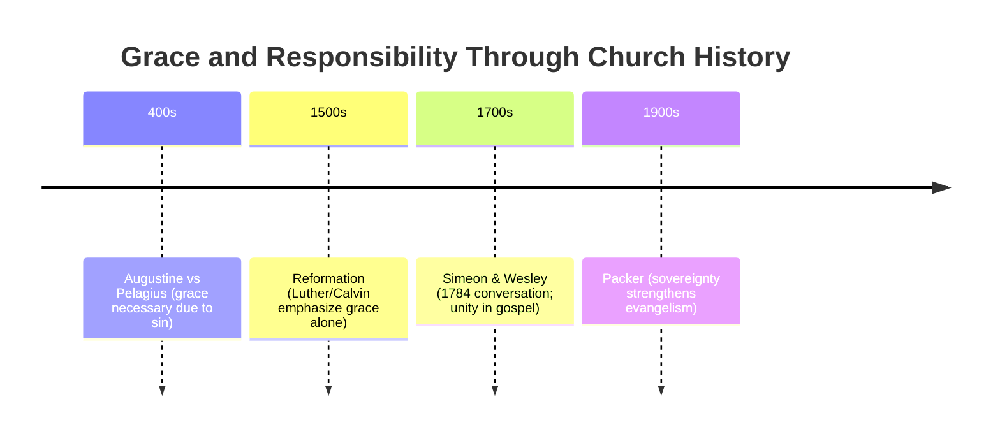

# {{ page.meta.title }}

**Date:** {{ page.meta.date }}  
**Instructor:** {{ page.meta.instructor }}  
**Course:** {{ page.meta.course }}  
**Description:** {{ page.meta.description }}  
**BibleReference:** {{ page.meta.bibleReference }}

## Course Scripture references

> *“But sanctify Christ as Lord in your hearts, always being ready to make a defense to everyone who asks you to give an account for the hope that is in you, yet with gentleness and reverence.”* (**1 Peter 3:15**) NASB  
> Christ commanded His disciples to teach others what He had taught them: *“Go therefore and make disciples of all the nations, baptizing them in the name of the Father and the Son and the Holy Spirit, teaching them to observe all that I commanded you.”* (**Matthew 28:19-20a**) NASB  
> Peter, speaking to Cornelius’ household of the command given by Christ to His disciples,
stated: *“And He ordered us to preach to the people, and solemnly to testify that this is the One who has been appointed by God as Judge of the living and the dead.* (**Acts 10:42**) NASB

## Reading / Memory Assignments

| Session              | Reading / Memory Assignments                                                                 |
| -------------------- | -------------------------------------------------- |
| Session 1, Part 1   | Read Ch. 1 of *"Evangelism and the Sovereignty of God"* |
| Session 1, Part 2   | Read Ch. 2 of *"Evangelism and the Sovereignty of God"* |
| Session 1, Part 3   | Read Ch. 3 of *"Evangelism and the Sovereignty of God"* |
| Session 1, Part 4   | Read Ch. 4 of *"Evangelism and the Sovereignty of God"* |
| Session 2, Part 1   | Memorize **Ephesians 2:8-9** |
| Session 2, Part 2   | Memorize **Romans 3:23, 6:23, 5:8** |
| Session 2, Part 3   | Memorize **Romans 10:9-10, 10:13** |
| Session 4 | Memorize the 4-part presentation of the Gospel given in this session |
| Session 6 | Read Chs. 1-4 of *"Teaching to Change Lives"* highlighting passages that make key points  |
| Session 7, Part 1 | Read Chs. 5-7 of *"Teaching to Change Lives"* highlighting passages that make key points |
| Session 7, Part 2 | Read pp. 1-78 of *"The Bible, Live"* |
| Session 8, Part 1   | Read pp. 81-151 of *"The Bible, Live"* |

## CDI Notes

**Instructors Guide** *(pg.33-38)*

At the end of this session:

You will KNOW:

- God’s expectation of His people, both Old and New Testaments, when it comes to evangelism.

You will BE ABLE TO:

- Articulate the Lord’s call to evangelism from several New Testament passages.

You will THINK ABOUT:

- Your own personal stake in evangelism.
- Telling others about Christ has both a universal component and a component.

**In the Last Session**

- We looked at evangelism and the Scripture’s teaching on soteriology.
- We discussed key terms and concepts that relate to both the meaning of salvation and to the process of one’s salvation.

Instructor’s Note: Instruct your students to highlight any Bible passage discussed in this session. They will be used in a group discussion at the end of the video. Come prepared to discuss Packer’s book, *“Evangelism and the Sovereignty of God.”* Hand out a list of page numbers of the passages you wish to discuss from the book and ask your students to comment on those passages.

Begin video.

**God Chose to Reach the World Through Israel**

- God chose to reach the world through Israel.
- In any discussion of the responsibility of evangelism it is instructive to go back to the Old Testament and discover God’s intent for His chosen people of Israel. What we find is that the people of God were called to make Him known to all nations. **1 Chron. 16:8** says, *“Oh give thanks to the Lord, call upon His name; Make known His deeds among the peoples.”* God’s intent was to reach the world through the people of Israel.

**Relationship Between Israel and Rest of Humanity**

- There is a relationship between Israel and the rest of humanity.
- The problem is this: to what extent does the concern for peoples everywhere surface in the Old Testament when its primary subject matter is Israel? Or, put another way, what relationship is there between the particular (Israel) and the universal (all peoples)? Proceeding from a New Testament base the situation is clearer. The church (a particular) has for its mission the spread of the knowledge of God to the nations (universal).

**Original Witness**

- Israel was the original witness to the truth of God’s salvation.
- There are 175 references in the Old Testament that point to God’s desire to save all people. Just as God desires to use the church to reach the world, so also, He desired Israel to be a witness for Him to all the world. Israel was to be a light to all nations. *“Sing praises to the Lord, who dwells in Zion; Declare among the peoples His deeds”* (**Psalm 9:11**).
- **Isaiah 43:8-12** is a powerful passage that speaks to God’s purposes for Israel when it comes to declaring truth to the world. In this passage, God calls the nations together to hear truth. Twice (vs. 43:10, 12) God declares about Israel that *“you are My witnesses!”* The content of that witness required of Israel is that God had announced it ahead of time, had saved Israel, and now lets it be heard.

**Church Witnesses to The World**

- In the New Testament, the Church witnesses to the world.
- The phrase in a parallel passage in the New Testament from **Acts 1:8** echoes almost the exact same words, *“And you shall be My witnesses.”* Like the word for witness in the New Testament, the Hebrew word refers to a person who has firsthand knowledge of an event or one who can testify based on a report which he has heard.
- Moving to the New Testament, the responsibility for evangelism is made clear in many striking and vivid statements. **Matthew 5:14-16** states, *“You are the light of the world. A city set on a hill cannot be hidden. Nor do men light a lamp, and put it under the peck-measure, but on the lampstand; and it gives light to all who are in the house. Let your light shine before men in such a way that they may see your good works, and glorify your Father who is in heaven.”*

**Our Light Revealed**

- Our light is revealed through good deeds.
- This passage from Matthew 5 speaks of good deeds as being a key part of our witness to others. How we reveal our light is through our good deeds. We aren’t called to control the power structures of our culture; neither are we promised that we can change the political climate or the values of our society. But we must remain active preservative agents, no matter the cost, in calling the world to heed God’s standards. In so doing, we must avoid the tendency to form isolated Christian enclaves to which the world pays little attention.

**Cannot Control Outcome of Our Witness**

- We cannot control the outcome of our witness, just our faithfulness.
- In **Matthew 5:13** Christ declares, *“You are the salt of the earth; but if the salt has become tasteless, how will it be made salty again? It is good for nothing anymore, except to be thrown out and trampled underfoot by men.”*
- We cannot control the results of our efforts to be witnesses to the world. The outcome is in the Lord’s sovereign hands. Our responsibility is to be certain that we do not shrink away from this call of God to be visible and active in the world. Israel shirked their responsibility in this area. It is vital that the church of Jesus Christ not repeat their failure.

**Evangelism Comes from Compassion**

- Evangelism comes from compassion for the lost.
- The church is to have compassion for the lost.
- **Matthew 9:36-38** states: *“And seeing the multitudes, He felt compassion for them, because they were distressed and downcast like sheep without a shepherd. Then He said to His disciples, ‘The harvest is plentiful, but the workers are few. Therefore, beseech the Lord of the harvest to send out workers into His harvest.’”*
- Looking at Matthew 9:36, notice first the condition of the unsaved. They were *“distressed”* (harassed – NIV). The tense of the verb indicates a state of existence existing before the time of the principal verb. Distressed originally meant to flay or skin. Thus, we have a graphic picture of the plight of individuals apart from Christ. Distressed often connoted the ideas of being battered, bruised, mangled, ripped apart worn out and exhausted.
- The second word Christ uses to describe the unsaved is the word *“downcast”* (helpless – NIV). This describes one who has been thrown down and is utterly helpless as from a mortal wound. Metaphorically it refers to those who are confused. Downcast can also refer to one who is neglected, that is, those who were not taught.
- Christ goes on to describe those who are unsaved as *“without a shepherd.”* This means they were without leadership or anyone to guide them. He did not see the unsaved as the enemy, but as those who had been captured by the enemy.

**Jesus Moved by Hopelessness of the Lost**

- Jesus was deeply moved by the hopelessness of the lost.
- Continuing to look at **Matthew 9:36** we discover something of Christ’s attitude toward the unsaved. *“And seeing the multitudes”* – Christ didn’t just take note of their outward circumstance, rather the verb “seeing” indicates that He perceived with understanding. Christ didn’t look at the outer being and culture, but at the heart condition.
- We tend to look at the outer – how a person looks, how they are dressed, their personality and sociability, their culture. Christ looked beyond that. He *“felt compassion.”* This is a strong emotional term. It means to be moved in the gut. It has the idea of being physically racked with emotion. What caused Christ’s deeply-felt compassion was not the many varieties of physical sickness that He has seen, but rather the great spiritual need of the people. The people were living aimless lives, having no center, living a daily experience of futility. Such a plight deeply moves Jesus.

**Many Unbelievers in Need of the Word**

- There are many unbelievers in need of hearing the Word.
- Moving on to **Matthew 9:37** we gain a perspective on evangelism from Christ. First, He states that *“the harvest is plentiful.”* There are two views on what Christ means by this statement. The first view is that He is referring to the coming judgment that these people will face one day. Some commentators see this verse as a warning to Israel that judgment time is near. But the word *“plentiful”* stands in the way of this interpretation. This makes sense only if the Greek word *“therismos”* used here does not mean “harvest-time” but “harvest-crop.”
- The second view, and the one I’m convinced is the preferred view, parallels a similar passage in **John 4:35** where the word *“harvest”* is used of the harvest of people who need the Gospel. The idea here is that there are many who need hearing about the salvation that is found only in Jesus Christ.

**God’s Plan is to Share His Word**

- God’s plan is for people to share His Word.
- **Matthew 9:37** also informs us that *“the workers are few.”* In contrast to the extensive nature of the harvest which is described as *“plentiful,”* the number of workers for this potentially abundant harvest is *“few.”*
- The Lord is telling us that there is a great need for Gospel witnesses. There is a great need for people who are willing to go and tell others about Christ. God, in His wisdom, chose to expand His kingdom through the efforts of people rather than through any other method. He could have chosen to simply line up the stars in the night sky to spell out *“Jesus Saves.”*
- Instead, Plan A is to wrap the Gospel message around each of the followers of Jesus Christ and send them out to tell a hurting and helpless world that there is hope.
- **Matthew 9:38** gives us Christ’s specific instructions to the believer.

**First Step, Prayer**

- Prayer is the first step of evangelism.
- First, we are to pray. Because of an overwhelming need, prayer is the first response we are to have. The idea here, (*“beseech the Lord of the harvest”*), is that the believer would make an intense request of God; that he would beg and implore God. This is much more than a suggestion; it is a command.
- The focus of this intense prayer is that God would *“send out workers into the harvest.”* God calls but man must respond. The question is not *“is God calling people to serve as witnesses?”* For we know from **2 Peter 3:9** that He desires that none would perish. The question is *“are we willing to serve?”*

**Review**

- We talked about a world that is distressed and downcast apart from a relationship with Jesus Christ calls for a clear response from Christ’s followers.
- Just like the Old Testament saints, the believer today has a responsibility to be light in a dark world. We have the responsibility to be a part of working in an abundant harvest of people who need the gospel.

**In the Next Session**

- Review key Scriptural passages that address our responsibility to be involved in evangelism.
- Discuss obstacles that make evangelism a challenge for the Christian in the modern era.

## Key Scripture Passages

| Passage | Theme |
|--------|-------|
| 1 Chron. 16:8 | Israel declaring God's works |
| Psalm 9:11 | Proclaiming God's deeds |
| Isaiah 43:8–12 | Israel as God's witnesses |
| Matthew 5:13–16 | Salt and light |
| Matthew 9:36–38 | Compassion for the lost |
| John 4:35 | The harvest is ready |
| Acts 1:8 | The church as witnesses |
| 2 Peter 3:9 | God's desire that none perish |
| Ephesians 2:8–9 | Salvation by grace (**memory verse**) |

### Scripture Text

> *Oh give thanks to the Lord, call upon His name;*  
> *Make known His deeds among the peoples.*  
> — **1 Chron. 16:8**

> *Sing praises to the Lord, who dwells in Zion;*  
> *Declare among the peoples His deeds.*  
> — **Psalm 9:11**

> *Bring out the people who are blind, even though they have eyes,*  
> *And the deaf, even though they have ears.*  
> *All the nations have gathered together*  
> *So that the peoples may be assembled.*  
> *Who among them can declare this*  
> *And proclaim to us the former things?*  
> *Let them present their witnesses that they may be justified,*  
> *Or let them hear and say, “It is true.”*  
> *“You are My witnesses,” declares the Lord,*  
> *“And My servant whom I have chosen,*  
> *So that you may know and believe Me*  
> *And understand that I am He.*  
> *Before Me there was no God formed,*  
> *And there will be none after Me.*  
> *I, even I, am the Lord,*  
> *And there is no savior besides Me.*  
> *It is I who have declared and saved and proclaimed,*  
> *And there was no strange god among you;*  
> *So you are My witnesses,” declares the Lord,*  
> *“And I am God.”*  
> — **Isaiah 43:8–12**

> *“You are the salt of the earth; but if the salt has become tasteless, how can it be made salty again?*  
> *It is no longer good for anything, except to be thrown out and trampled under foot by men.*  
>
> *“You are the light of the world. A city set on a hill cannot be hidden; nor does anyone light a lamp and put it under a basket, but on the lampstand, and it gives light to all who are in the house.*  
>
> *“Let your light shine before men in such a way that they may see your good works, and glorify your Father who is in heaven.”*  
> — **Matthew 5:13–16**

> *Seeing the people, He felt compassion for them, because they were distressed and dispirited like sheep without a shepherd. Then He said to His disciples, “The harvest is plentiful, but the workers are few. Therefore beseech the Lord of the harvest to send out workers into His harvest.”*  
> — **Matthew 9:36–38**

> *“Do you not say, ‘There are yet four months, and then comes the harvest’?  Behold, I say to you, lift up your eyes and look on the fields, that they are white for harvest.”*  
> — **John 4:35**

> *“But you will receive power when the Holy Spirit has come upon you; and you shall be My witnesses both in Jerusalem, and in all Judea and Samaria, and even to the remotest part of the earth.”*  
> — **Acts 1:8**

> *The Lord is not slow about His promise, as some count slowness, but is patient toward you, not wishing for any to perish but for all to come to repentance.*  
> — **2 Peter 3:9**

> *For by grace you have been saved through faith; and that not of yourselves, it is the gift of God; not as a result of works, so that no one may boast.*  
> — **Ephesians 2:8–9** *(Memory Verse)*

## Class Exercise

**INSTRUCTOR’S NOTES: PRAY FOR PEOPLE**

Discuss the passages addressed in this session.

Do the students agree or disagree with the conclusions drawn from these passages?

Discuss whatever message those in the church may have been receiving that would be different than that which has been outlined in this session.

Come prepared to discuss Packer’s book, *“Evangelism and the Sovereignty of God.”*

Hand out a list of page numbers for the passages you wish to discuss from the book and ask your students to comment on those passages.

### Discussion Pages from Chapter 1 – Divine Sovereignty

Students should read and prepare to discuss the following pages from Chapter 1:

| Page | Topic for Discussion |
|-----|----------------------|
| **18** | Charles Simeon and John Wesley conversation about grace |
| **19–20** | The relationship between divine sovereignty and human responsibility |
| **21–22** | Why belief in God’s sovereignty encourages evangelism |
| **23–24** | Misunderstandings about Calvinism and evangelism |
| **25–26** | Why prayer and evangelism go together |

### Historical Illustration – Charles Simeon and John Wesley

> *It is instructive in this connection to ponder Charles Simeon’s account of his conversation with John Wesley on December 10, 1784 (the date is given in Wesley’s journal): “Sir, I understand that you are called an Arminian; and I have been sometimes called a Calvinist; and therefore I suppose we are to draw daggers. But before I consent to begin the combat, with your permission I will ask you a few questions. . . . Pray, Sir, do you feel yourself a depraved creature, so depraved that you would never have thought of turning to God, if God had not first put it into your heart?” “Yes,” says the veteran, “I do indeed.” “And do you utterly despair of recommending yourself to God by anything you can do; and look for salvation solely through the blood and righteousness of Christ?” “Yes, solely through Christ.” “But, Sir, supposing you were at first saved by Christ, are you not somehow or other to save yourself afterwards by your own works?” “No, I must be saved by Christ from first to last.” “Allowing, then, that you were first turned by the grace of God, are you not in some way or other to keep yourself by your own power?” “No.” “What, then, are you to be upheld every hour and every moment by God, as much as an infant in its mother’s arms?” “Yes, altogether.” “And is all your hope in the grace and mercy of God to preserve you unto his heavenly kingdom?” “Yes, I have no hope but in him.” “Then, Sir, with your leave I will put up my dagger again; for this is all my Calvinism; this is my election, my justification by faith, my final perseverance: it is in substance all that I hold, and as I hold it; and therefore, if you please, instead of searching out terms and phrases to be a ground of contention between us, we will cordially unite in those things wherein we agree.”*

### Historical Background

The conversation between Charles Simeon and John Wesley reflects a much older theological discussion within the church about the relationship between God’s grace and human responsibility.

This issue was first strongly debated in the early church between **Augustine of Hippo** and **Pelagius** in the fifth century. Pelagius taught that human beings possess the natural ability to obey God and choose righteousness without the necessity of divine grace. Augustine, however, argued from Scripture that humanity is deeply affected by sin and that salvation must begin with the grace of God working in the human heart.

Augustine’s emphasis on the necessity of grace strongly influenced later Protestant theology during the Reformation. Reformers such as Martin Luther and John Calvin affirmed that salvation is entirely dependent upon God’s grace, while still calling people to respond to the gospel in repentance and faith.

The conversation between Simeon and Wesley demonstrates that although Christians may use different theological language, they often affirm the same central truth: that salvation from beginning to end depends upon the grace of God through Jesus Christ.

## Discussion Questions

1. **Why do you think this issue of God's grace and human responsibility has been discussed throughout church history?**

    I believe this issue has been discussed throughout church history because it touches on a very deep tension within the human heart that goes all the way back to the fall in the Garden of Eden. In **Genesis 3**, the serpent tempted humanity with the idea that they could be *“like God, knowing good and evil.”* At its core, this was a desire for autonomy—the desire to determine truth and destiny apart from God.

    That same impulse continues to surface in theological discussions about salvation. Human beings naturally want to believe that they contribute something to their own salvation or retain some measure of control over their spiritual destiny. Yet Scripture consistently teaches that salvation is ultimately the work of God's grace from beginning to end.

    At the same time, the Bible clearly calls people to repent and believe the gospel. Because both truths appear in Scripture—God’s sovereign grace and human responsibility—the church has wrestled with how to understand them together. This discussion can be traced throughout church history, from the debates between Augustine and Pelagius, through the Reformation, and even into modern conversations such as those highlighted by Packer.

2. **Why does Packer argue that belief in God’s sovereignty should encourage evangelism rather than discourage it?**

    Packer argues that belief in God's sovereignty should encourage evangelism because it gives believers confidence that the success of the gospel does not ultimately depend on human ability or persuasion, but on God's power to save. While every person is responsible for their response to the gospel, Christians are responsible to faithfully proclaim it. Scripture commands believers to preach the gospel to all people, trusting that God will work through that message to bring people to faith.

    Because God has chosen to accomplish His saving purposes through the proclamation of the gospel, evangelism becomes the means through which He gathers His people. If salvation depended entirely on human effort, evangelism could easily become discouraging. But because God is sovereign, believers can share the gospel with confidence, knowing that He is able to open hearts and bring people to repentance and faith.

    This is why passages such as **2 Peter 3:9** emphasize God's patience toward humanity. *God is not slow in fulfilling His promises but is patiently working out His redemptive plan in history*. As the gospel continues to be proclaimed, God calls people to Himself through that message. Therefore, belief in God's sovereignty does not weaken evangelism—it strengthens it by assuring believers that God is actively working through the message of the gospel.

3. **How does belief in God’s sovereignty affect the way we pray for unbelievers?**

    Belief in God's sovereignty gives believers confidence and urgency in prayer for unbelievers. Because we know that salvation ultimately comes from the Lord, we recognize that no human argument or persuasion can change a person's heart apart from God's work. Scripture teaches that *faith comes through hearing the Word of Christ* (**Romans 10:17**), but it is God who opens the heart to receive that truth.

    Knowing this, believers pray earnestly for those who do not yet know Christ. We ask God to open their hearts, grant repentance, and bring them to faith. Our prayers acknowledge that while we faithfully share the gospel, it is God who must give spiritual life and understanding.

    Therefore, belief in God's sovereignty does not make prayer unnecessary; it makes prayer essential. Since God alone can change hearts, we depend on Him in prayer for the salvation of those around us.

    **2 Timothy 2:25**
    > *“…if perhaps God may grant them repentance leading to the knowledge of the truth.”*

4. **Why does Packer say that evangelism without prayer misunderstands the doctrine of sovereignty?**

    Packer explains that evangelism without prayer misunderstands the doctrine of God's sovereignty because it assumes that human effort alone can bring someone to faith. Scripture teaches that while believers are called to proclaim the gospel, only God can change the human heart and bring someone to repentance and faith. If salvation ultimately depends on God's work, then prayer must accompany evangelism.

    Prayer expresses our dependence on God. When we pray for unbelievers, we are acknowledging that God alone can open their eyes, soften their hearts, and bring them to faith through the message of the gospel. Without prayer, evangelism can become an exercise in relying on human persuasion rather than trusting in God's power.

    Therefore, prayer and evangelism belong together. As believers share the gospel, they must also pray that God will work through His Word to bring people to salvation. In this way, prayer demonstrates a proper understanding of God's sovereignty in the work of salvation.

    **Romans 10:1**

    > *“Brethren, my heart’s desire and my prayer to God for them is for their salvation.”*

5. **What did you agree with, disagree with, or find difficult to understand in this chapter?**

    I agreed strongly with Packer’s main argument that belief in God’s sovereignty should encourage evangelism rather than weaken it. His explanation that prayer and evangelism go hand in hand was particularly helpful, because it shows that if we truly believe God is the one who changes hearts, then prayer must be central to our evangelistic efforts. I also appreciated the illustration of the conversation between Charles Simeon and John Wesley, which demonstrated that even believers who differ in theological terminology often share the same core understanding that salvation depends entirely upon the grace of God.

    One area that many Christians may find difficult is understanding how God's sovereignty and human responsibility work together. Scripture clearly teaches both truths, yet our limited understanding can struggle to reconcile them fully. However, rather than trying to eliminate one truth in favor of the other, Packer encourages believers to accept both as biblical realities and to remain faithful in proclaiming the gospel while trusting God with the results.

    Overall, this chapter strengthened my understanding that evangelism is both a command and a privilege. Believers are called to faithfully share the gospel, pray for the salvation of others, and trust that God will accomplish His purposes through the proclamation of His Word.

---

Have your students write the names of 10 individuals they know personally who do not know Christ.

## Prayer for Salvation

1. Jon - Larry's neighbor
2. Sue - Larry's neighbor
3. Julie - Dog sitter
4. Lee and Ashley - Assurance of Salvation
5. Samuel, Michael, and Reagan - Assurance of Salvation
6. Jerin, Brittany, Ellana - Assurance of Salvation
7. Chris, Casey and Charlie - Assurance of Salvation
8. David M. - Air Force buddy
9. Ken G. - Long time friend
10. John K. - Long time friend - Assurance of Salvation

Then ask the students to commit to praying for those 10 people each day for the next week.

Ask your students to memorize **Ephesians 2:8-9**.

**Below this is AI driven reference material**

### A Conversation About Faith and Christ's Work

Someone once asked me, *“So when you became a Christian, did you decide to follow Christ?”*

I replied, *“Yes, I absolutely made a decision to follow Him. There was a moment when I heard the gospel and responded in faith.”*

They then asked, *“So do you believe your decision is what saved you?”*

I paused for a moment and said, *“When I first came to Christ, I probably would have said that my decision was the most important part. But as I’ve grown in my understanding of Scripture, I’ve come to see that my decision was really a response to something God was already doing.”*

They asked, *“What do you mean by that?”*

I said, “Well, the Bible says that *‘faith comes from hearing, and hearing by the word of Christ’* (**Romans 10:17**). Someone shared the gospel with me, I heard the message of Christ, and I responded in faith. But even that response happened because God was working through His Word.”

They thought about that and asked, *“So you’re saying both things are true—you chose to follow Christ, but God was already directing the work?”*

I answered, *“Exactly. My decision to follow Christ was real, but it was not something I produced on my own. It was a response to the grace of God and the work of Christ on the cross.”*

Then I added, *“That’s why my confidence isn’t really in the strength of my decision. My hope is in what Christ has done for me.”*

And we both agreed that salvation ultimately rests not on our ability, but on **the finished work of Christ and the grace of God that calls us to respond in faith**.