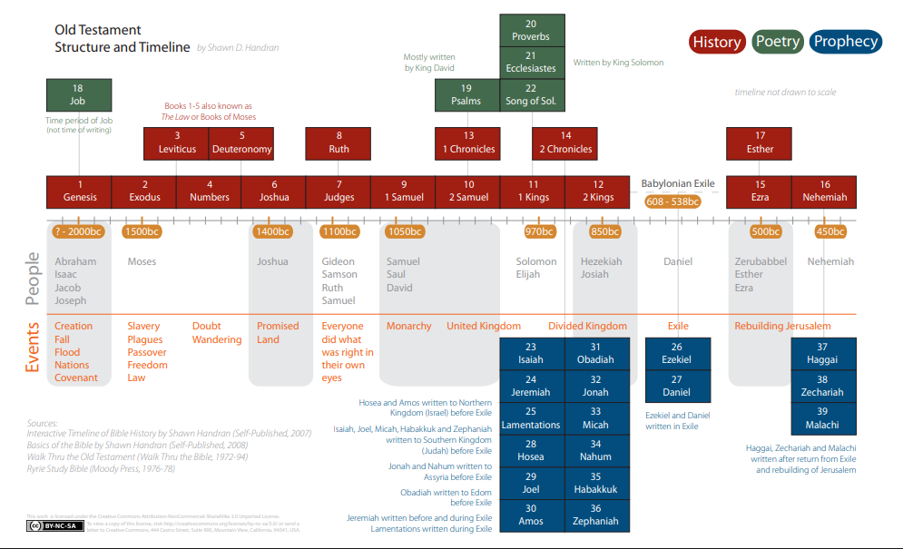

# {{ page.meta.title }}

**Date:** {{ page.meta.date }}  
**Writer:** {{ page.meta.writer }}  
**Category:** {{ page.meta.category }}  
**Description:** {{ page.meta.description }}  
**BibleReference:** {{ page.meta.bibleReference }}

## CDI Notes

**Instructors Guide** *(pg.30)*

You will KNOW:

- The development of language as it pertains to the communication of God’s word to His creation.

You will be ABLE TO:

- Note the history of the OT language, the development of its writings, and the primary place the Hebrew writings occupy in God’s desire to deliver His word to the world.

You will THINK ABOUT:

- How the use of the original Biblical languages aids in the study of both the Old and New Testaments.
- Whether our understanding of the early Scriptures could be improved by seeing them as something other than the “Old” Testament.

**Begin video**

Review of Previous Session

- Reviewed the doctrine of inspiration
- Noted the roots of the New Testament Scriptures in the Old Testament.
- When the NT authors referred to *“the Scriptures,”* they meant what we call the *“Old Testament.”*
- Began to consider the three-fold division of the Hebrew Scriptures, The Law, The Prophets, The Psalms.

Preview

- The history of language.
- The history of the development of writing.
- The primary place the Hebrew language occupies in God’s desire to bring his Word to the world.

Languages of Bible Manuscripts

- Old Testament written primarily in Hebrew with several short passages written in Aramaic.
- Documents of the New Testament were composed in Greek.
- The Septuagint (LXX), is an important and early Greek translation of the Old Testament that was done in Alexandria, Egypt, around the 3rd century BC.
- Familiarity with the Biblical languages will enable the student of the Scripture to
better use many excellent Bible study tools.

Origins of Language

- After God created Adam, communication between them began.
- Adam was equipped with the ability to reason and to perceive words and commands.
- When the LORD commanded Adam: *“You are free to eat from any tree in the garden; but you must not eat from the tree of the knowledge of good and evil, for when you eat of it you will surely die.”* (Genesis 2:16-17) From his earliest hours man could hear, receive instruction, understand language and be responsible
before God for the appropriate response.
- That the LORD would entrust Adam with naming the animals testifies to the innate language and reasoning skills which he possessed. Genesis 2:19-20
- It is easily inferred that the Creator, who is himself *“the Word,”* and created man in his own image, had equipped the man with language skill.
- In the initial conversations between God, Adam, Eve and the serpent a profound depth of linguistic skill is recorded.
- Concerning man’s earliest language skills there is sufficient evidence from ancient literature, culture and architecture to readjust our thinking concerning the intelligence of early man.
- Created in the image and likeness of God, Adam and Eve and their first descendants would have possessed the highest degree of intelligence, reasoning power, intuition and creative genius.
- As such, their ability to communicate, plan and remember would very likely stagger our imaginations.
- It is not unreasonable to suggest that Adam and Eve and the earliest generations would not have been as dependent on written records for the transmission of their history.
- Consider the importance of storytelling in man’s earliest communications.
- Some of the most obvious elements of the first chapters of the Bible are narrative and genealogy.
- Introduced to what should be recognized as a style of poetry, first in God’s decision to create man, then in Adam’s words at first sight of Eve and again in the passage of judgment in Genesis 3.
- All this hints at language skills of a high order from the beginning of our race.
- The long life-span of pre- and early post-flood peoples would allow for generational sharing ensuring great accuracy of detail and significance.
- The global flood of Genesis 6-9, would likely have destroyed evidence of any written or even engraved communication.

The Effects of Babel

- The Bible says that following the flood, *“…the whole world had one language and a common speech.”* Genesis 11:1
- God saw in the peoples’ plan to *“build for ourselves a city, with a tower that reaches to the heavens,”* a rebellious attitude. Genesis 11:4
- Their refusal of the command to *“fill the earth”* (Genesis 9:1), led to the confounding of their language for their own protection.
- The result was a separation into language groups that then began to fill the various regions of the earth.
- These events most likely occurred around 2200 BC in the lifetime of Peleg (Genesis 10:25; 11:18), and near the time of the birth of Abraham.
- The confusion of languages at Babel, and decreasing life-spans of post-Flood peoples likely led to an increased need for written communication.

Written Communication

- Early forms of written communication include *“pictograms,”* *“ideagrams,”* and *“phonograms.”* There is archeological evidence that writing developed along these lines.
- Recommended reading: F.F. Bruce’s The Books and the Parchments, Chapter 2, and *“In the Beginning”* by Joel F. Hoffman.
- F.F. Bruce states: *“Egyptian scribes, as early as 3000 BC began to develop out of their hieroglyphic writing a sort of alphabet of 24 signs, representing all theconsonants current in their language.”* (F.F. Bruce, The Books and theParchments,” p. 26)
- The Egyptians, however, seemed to use this “*alphabet”* simply to supplement their hieroglyphic writing.
- The great achievement that then happened apparently is attributed to some unknown Semitic genius (a descendent of Noah’s son Shem, the father of the Hebrew line). He began to use these common phonetic symbols as an alphabet to form words that conveyed ideas.
- F.F. Bruce says, *“A few peoples (the ancient Cypriotes, the Japanese, and others), developed a syllabary. But only the Syro-Phonecian Semites produced a genius who created the alphabetic writing, from which have descended all past and present alphabets.”* (Ibid., p.26)
- Hoffman argues persuasively that the credit for this early alphabet should be given to someone of Jewish heritage and that the Hebrew language was the first to use individual letters combined to form words. He also points out that there is strong evidence that the alphabets, and therefore the written languages of Europe
and Asia developed from this original Hebrew concept of alphabetic writing.
- By the time of Moses, the author of Genesis through Deuteronomy, around 1500 BC, who, we read *“was educated in all the wisdom of the Egyptians and was powerful in speech and action,”* (Acts 7:22), alphabetic writing had developed and was available for the inspired written revelation of God.

## Key Verses

**(Genesis 2:16-20, 9:1-20:25, 11:1-18; Acts 7:22; 2 Timothy 2:15)**

## Class Exercise

Using the statements written at the beginning of class on the white board, review with your students that they KNOW, ARE ABLE TO and WILL BE THINKING ABOUT the key messages from this session.

Have your students continue working on the Bible timeline. Pay particular attention to the detailed genealogies of Genesis 5 and 11, and mark the beginnings of written language.

Note the overlapping ages of the pre-Flood genealogies on the Timeline. Dates are approximate.

Be prepared to discuss the KNOW, ARE ABLE TO and WILL BE THINKING ABOUT statements from this session that appear at the beginning of this session in your guidebook.

Continue working on the Bible timeline. Pay particular attention to the detailed genealogies of Genesis 5 and 11, and mark the beginnings of written language.

Mark the overlapping ages of the pre-Flood genealogies on the timeline. Remember dates are approximate.
