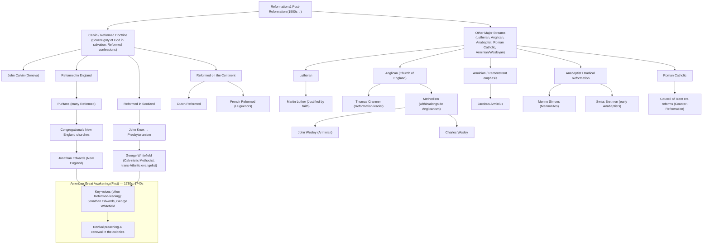
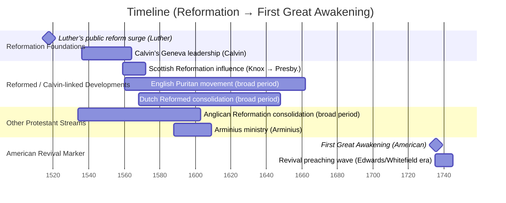

# {{ page.meta.title }}

**Date:** {{ page.meta.date }}  
**Instructor:** {{ page.meta.instructor }}  
**Course:** {{ page.meta.course }}  
**Description:** {{ page.meta.description }}  
**BibleReference:** {{ page.meta.bibleReference }}

## CDI Notes

### gantt chart

